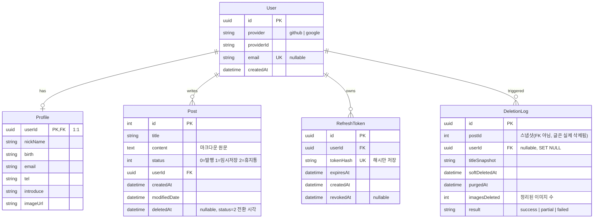

# v2.0.0 — DB ERD & 글 삭제 자동화 설계 문서 (myblog)

> 이 문서는 [Next.js 전환 설계 문서](./2026-07-11-nextjs-migration-design.md)의 **§2.1 데이터 모델**을 구체화한 하위 설계다.

## Context (왜 이 문서를 만드는가)

Next.js/NestJS 전환(v2.0.0)으로 Supabase Postgres를 **자체 Postgres + Prisma**로 이관한다. 이때
1. 클라이언트가 직접 다루던 스키마를 서버가 소유하게 되므로 **테이블/관계/제약을 명시적으로 확정**해야 하고,
2. 자체 인증(JWT)·자체 스토리지(MinIO)를 쓰므로 기존엔 없던 **RefreshToken / 삭제 감사(DeletionLog)** 테이블이 필요하며,
3. 현재 삭제는 `status=2` 소프트 삭제뿐(영구삭제·이미지 정리 없음)이라, **유예기간 후 자동 영구삭제 + 이미지 정리** 파이프라인을 설계해야 한다.

### 확정 사항
- 삭제 정책: **소프트삭제(휴지통, 복구 가능) + 유예기간(기본 30일) 경과 후 자동 영구삭제**
- 자동화 방식: **NestJS `@nestjs/schedule` cron 작업**(앱 내부에서 DB purge + MinIO 이미지 정리)
- ERD 범위: **현재 기능(User·Profile·Post) + 인증/삭제 자동화용(RefreshToken·DeletionLog)**

---

## 1. ERD (Entity Relationship Diagram)



### 관계 요약
- **User 1 : 0..1 Profile** — 사용자당 프로필 1개(`Profile.userId`가 PK 겸 FK).
- **User 1 : N Post** — 작성자 관계. (개인 블로그이므로 사실상 관리자 1명이지만 스키마는 다중 사용자 대응.)
- **User 1 : N RefreshToken** — 기기/세션별 refresh 토큰. 회전(rotation) 시 이전 토큰 `revokedAt` 표기.
- **User 1 : N DeletionLog** — 삭제 자동화 감사 로그. 글은 영구삭제되므로 Post와는 FK를 걸지 않고 `postId`/`titleSnapshot`을 스냅샷으로 보관.

---

## 2. 테이블 상세 & Prisma 스키마

전환 설계 문서 §2.1의 스키마에 **`Post.deletedAt`, `RefreshToken`, `DeletionLog`, `PostStatus` enum, 인덱스/삭제 규칙**을 보강한다.

```prisma
/// 게시글 상태 (packages/shared 로 공유)
enum PostStatus {
  PUBLISHED @map("0")   // 0 — 발행
  DRAFT     @map("1")   // 1 — 임시저장
  TRASHED   @map("2")   // 2 — 휴지통(소프트삭제)
}
// ↑ 기존 정수값(0/1/2) 그대로 매핑 → 데이터 이관 시 변환 불필요.
//   Prisma enum 매핑이 부담되면 Int 유지 + shared 상수로 관리해도 됨.

model User {
  id         String        @id @default(uuid())
  provider   String        // "github" | "google"
  providerId String
  email      String?       @unique
  createdAt  DateTime      @default(now())

  profile       Profile?
  posts         Post[]
  refreshTokens RefreshToken[]
  deletionLogs  DeletionLog[]

  @@unique([provider, providerId])
}

model Profile {                       // 기존 userInfo
  userId    String  @id
  user      User    @relation(fields: [userId], references: [id], onDelete: Cascade)
  nickName  String?
  birth     String?
  email     String?
  tel       String?
  introduce String?
  imageUrl  String?
}

model Post {
  id           Int        @id @default(autoincrement())
  title        String
  content      String     // 마크다운 원문 (이미지 URL 포함)
  status       Int        @default(0)   // 0 발행 / 1 임시 / 2 휴지통
  userId       String
  author       User       @relation(fields: [userId], references: [id], onDelete: Cascade)
  createdAt    DateTime   @default(now())
  modifiedDate DateTime   @updatedAt
  deletedAt    DateTime?  // status=2 전환 시각 (유예기간 계산 기준)

  @@index([status, createdAt(sort: Desc)])  // 목록/페이지네이션 (status=0)
  @@index([status, deletedAt])              // purge 대상 조회 (status=2 & 만료)
  @@index([userId])
}

model RefreshToken {
  id        String    @id @default(uuid())
  userId    String
  user      User      @relation(fields: [userId], references: [id], onDelete: Cascade)
  tokenHash String    @unique          // 원문 토큰이 아닌 해시만 저장
  expiresAt DateTime
  createdAt DateTime  @default(now())
  revokedAt DateTime?                  // 회전/로그아웃 시 무효화

  @@index([userId])
}

model DeletionLog {
  id            String   @id @default(uuid())
  postId        Int                     // 스냅샷 (Post는 실제 삭제되므로 FK 없음)
  userId        String?
  user          User?    @relation(fields: [userId], references: [id], onDelete: SetNull)
  titleSnapshot String
  softDeletedAt DateTime
  purgedAt      DateTime @default(now())
  imagesDeleted Int      @default(0)
  result        String   @default("success")  // success | partial | failed

  @@index([purgedAt])
}
```

### 참조 무결성(ON DELETE) 정리
| 관계 | 규칙 | 이유 |
|------|------|------|
| Profile → User | **CASCADE** | 사용자 삭제 시 프로필 동반 삭제 |
| Post → User | **CASCADE** | 사용자 삭제 시 글 동반 삭제(개인 블로그). 별도 archive 필요하면 RESTRICT로 변경 |
| RefreshToken → User | **CASCADE** | 사용자 삭제 시 세션 토큰 제거 |
| DeletionLog → User | **SET NULL** | 사용자가 사라져도 삭제 감사 기록은 보존 |

---

## 3. 글 삭제 상태 머신 & 자동화 파이프라인

### 3.1 상태 전이

```
[발행 status=0] ──삭제요청──▶ [휴지통 status=2, deletedAt=now()]
        ▲                              │
        │                     ┌────────┴─────────┐
        └──복구(유예기간 내)──┘        │ (유예기간 경과)
                                        ▼
                        [영구삭제: Post row DELETE + MinIO 이미지 제거 + DeletionLog 기록]
```

- **소프트삭제**: 기존 [components/post/postDelete.js](../components/post/postDelete.js)의 `update status=2` + 소유권 검증([components/crud/checkPostOwner.js](../components/crud/checkPostOwner.js)) 로직을 `PostsService.softDelete()`로 서버 이관. 이때 **`deletedAt=now()`도 함께 기록**(신규).
- **목록 제외**: 모든 공개 조회는 `WHERE status = 0`. 휴지통 조회(`GET /posts?status=2`)는 소유자 전용.
- **복구**: `POST /posts/:id/restore` — 유예기간 내 소유자가 `status=0`(또는 이전 상태), `deletedAt=null`로 되돌림.
- **영구삭제(purge)**: 아래 스케줄러가 수행. 수동 즉시삭제가 필요하면 `DELETE /posts/:id?hard=true`(소유자/관리자) 엔드포인트로 같은 purge 루틴 재사용.

### 3.2 NestJS 스케줄 작업 (`@nestjs/schedule`)

`PostsModule` 내 `PostPurgeService`:

```ts
@Injectable()
export class PostPurgeService {
  private readonly graceDays = Number(process.env.POST_PURGE_GRACE_DAYS ?? 30);

  constructor(
    private readonly prisma: PrismaService,
    private readonly storage: StorageService,   // MinIO 래퍼 (UploadModule 공유)
  ) {}

  // 매일 03:00 KST 실행
  @Cron('0 3 * * *', { timeZone: 'Asia/Seoul' })
  async purgeExpiredTrash() {
    const threshold = new Date(Date.now() - this.graceDays * 864e5);
    const expired = await this.prisma.post.findMany({
      where: { status: 2, deletedAt: { lt: threshold } },
      select: { id: true, title: true, content: true, userId: true, deletedAt: true },
    });

    for (const post of expired) {
      let imagesDeleted = 0;
      let result = 'success';
      try {
        // 1) 본문 마크다운에서 이미지 URL 추출 후 MinIO 오브젝트 삭제
        imagesDeleted = await this.storage.deleteByMarkdown(post.content);
        // 2) DB 행 영구삭제 + 감사 로그를 한 트랜잭션으로
        await this.prisma.$transaction([
          this.prisma.post.delete({ where: { id: post.id } }),
          this.prisma.deletionLog.create({
            data: {
              postId: post.id, userId: post.userId,
              titleSnapshot: post.title, softDeletedAt: post.deletedAt!,
              imagesDeleted, result: 'success',
            },
          }),
        ]);
      } catch (e) {
        result = 'failed';
        await this.prisma.deletionLog.create({ data: { /* ...실패 기록... */ } });
        this.logger.error(`purge 실패 postId=${post.id}`, e);
      }
    }
  }
}
```

### 3.3 이미지 정리 로직 (MinIO)

`StorageService.deleteByMarkdown(content)`는 발행 시 URL 치환 로직([replacePreviewImagesToUploadedUrls.js](../components/postCreate/inputcontent/replacePreviewImagesToUploadedUrls.js))의 **역방향**이다.

- 정규식 `/!\[[^\]]*\]\((https?:\/\/[^)]+)\)/g`로 본문의 이미지 URL 수집(기존 blob 정규식을 실제 URL용으로 변형).
- MinIO 공개 URL에서 버킷/오브젝트 키를 파싱 → `removeObjects(bucket, keys)`로 일괄 삭제.
- **중요**: 삭제 전 다른 글이 같은 오브젝트를 참조하지 않는지 확인(참조 카운팅) 또는 업로드 시 글별 고유 경로(`posts/{postId}/{uuid}.ext`) 규칙을 강제해 공유 위험 제거 — **후자를 권장**(전환 설계 §2.4 업로드 경로 규칙에 반영).
- 부분 실패는 `DeletionLog.result='partial'`로 남기고 재시도 대상으로 표시.

### 3.4 부가 정리(선택)
- **고아 이미지(orphan)**: 임시저장 중 업로드됐으나 발행되지 않고 버려진 이미지. 별도 주간 cron으로 `posts/{postId}` 경로 중 어떤 Post에도 참조되지 않는 오브젝트 정리. (초기엔 생략 가능, 리스크로 명시)
- **만료 RefreshToken 정리**: `revokedAt IS NOT NULL OR expiresAt < now()` 토큰을 같은 스케줄러에서 주기 삭제.

---

## 4. 데이터 이관 시 주의점 (ERD 관점)
- 기존 `Posts.status` 정수값(0/1/2)을 그대로 적재 → `deletedAt`은 이관 시점에 `status=2`인 글에 한해 세팅. **소급 세팅 시 이관 직후 유예기간이 즉시 만료돼 대량 purge되지 않도록** 첫 실행 전 `deletedAt`을 이관일 기준으로 리셋 권장.
- 기존 `userInfo` → `Profile` 컬럼 1:1 매핑. Supabase auth user id → 새 `User.id` 매핑 테이블 필요(전환 설계 §5와 동일).
- `RefreshToken`/`DeletionLog`는 신규 테이블 → 초기 비어 있음.

---

## 5. 검증 방법 (end-to-end)
- **스키마**: `prisma migrate dev` 성공, 인덱스/제약 생성 확인. `prisma studio`로 관계 확인.
- **소프트삭제/복구**: 글 삭제 → `status=2 & deletedAt` 세팅 확인, 공개 목록에서 제외 확인, 복구 → `status=0 & deletedAt=null` 확인. 타인 글 삭제 차단(소유권 가드).
- **자동 purge**: `POST_PURGE_GRACE_DAYS=0`으로 낮춰 `deletedAt`을 과거로 조작한 시드 글에 대해 cron 수동 트리거 → Post 행 삭제 + MinIO 오브젝트 제거 + `DeletionLog` 1건 생성 확인. 트랜잭션 롤백(이미지 삭제 실패 시) 동작 확인.
- **이미지 정리**: 본문 이미지가 있는 글 purge 후 MinIO에서 해당 키 부재 확인, 타 글이 참조하는 이미지는 보존되는지(고유 경로 규칙) 확인.
- **RefreshToken**: 로그인 회전 시 이전 토큰 `revokedAt` 세팅, 만료 토큰 정리 확인.

---

## 6. 후속 반영
- 전환 설계 문서 [§2.1](./2026-07-11-nextjs-migration-design.md)의 Prisma 스키마를 이 문서의 추가분(`deletedAt` / `RefreshToken` / `DeletionLog`)으로 갱신.
- 전환 설계 §2.4(파일 저장소)에 **글별 고유 이미지 경로(`posts/{postId}/{uuid}.ext`)** 규칙 명시.
